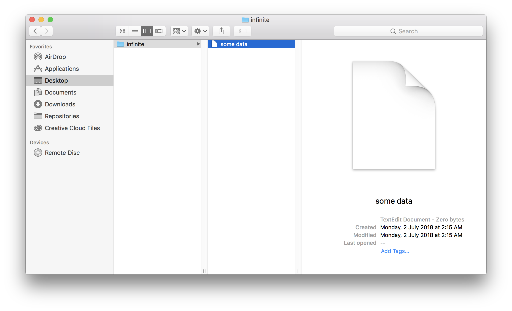

# Infinite

[](https://godoc.org/github.com/ravernkoh/infinite)
[](https://goreportcard.com/report/ravernkoh/infinite)
[](https://travis-ci.org/ravernkoh/infinite)

The database that can store the Internet.

Wouldn't it be awesome if you could save the entire Internet into a database?
Well, you can now do so! Infinite exploits a simple loophole in your operating
system to enable you to store an infinite amount of data, without using a
single byte.

## How it works

A file contains data, which is measured in bytes. If a file contains `Hello!`,
it takes up 7 bytes (remember to count the newline character). If a file
contains `Bye bye~`, it takes up 9 bytes. _Simple_.

Now what if a file contains nothing? How many bytes would the file take up?
That's right, 0! But a file can still store data, even if it contains nothing.
Where? In its _name_ of course! If we store data in its name, we can now have a
file that stores data, but contains nothing, and thus takes up 0 bytes!

Here, have some evidence.



## Installation

Infinite is available as a binary and also as a Go package.

### Binary

If Go is installed, the following command can be run to install the binary.

```bash
$ vgo get github.com/ravernkoh/infinite/...
```

Otherwise, the binary for each platform can be downloaded from the [releases](https://github.com/ravernkoh/infinite/releases)
page.

### Package

Use `vgo` to download the package.

```bash
$ vgo get github.com/ravernkoh/infinite
```

## Usage

The binary can be used to explore existing Infinite nodes or create new ones.

```bash
# Create root node called db
$ mkdir db

# Set the value to "value"
$ infinite value db --set value

# Create a child node called "child"
$ infinite children db --new child

# Print the value of the node
$ infinite value db
value

# Print the list of child nodes
$ infinite children db
child
```

Examples for the package can be found in the [documentation](https://godoc.org/github.com/ravernkoh/infinite).

## Complex documentation

Okay, jokes aside, this project exists simply because I haven't wrote Go in a
while. The idea of an infinite database was just a joke I made while half asleep
in class.
